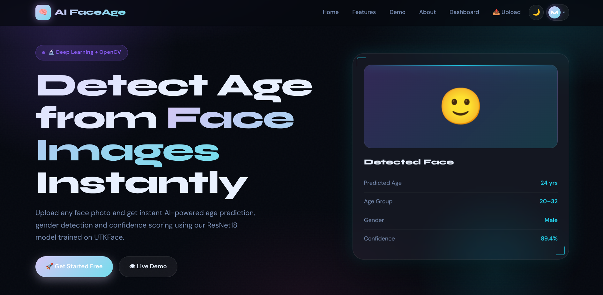
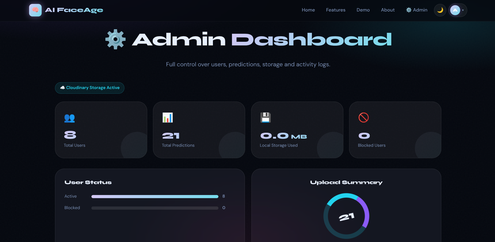
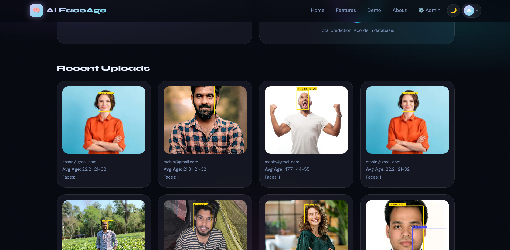
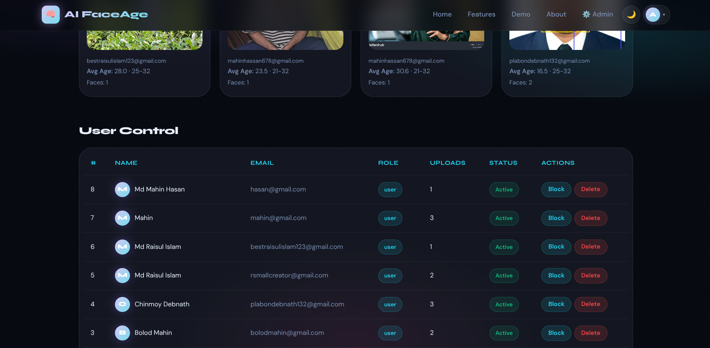
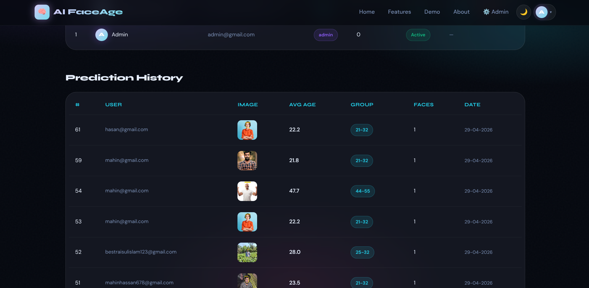
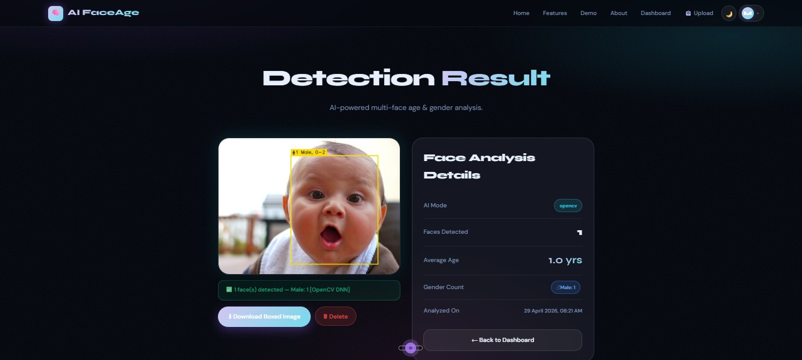
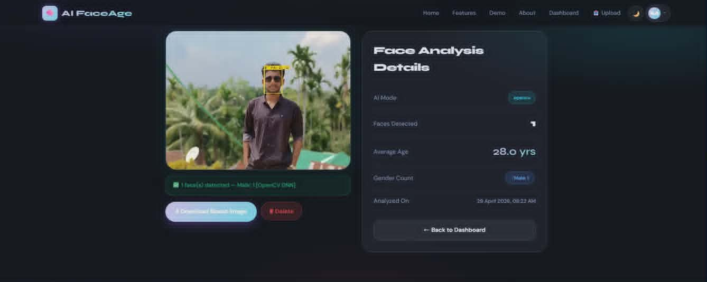
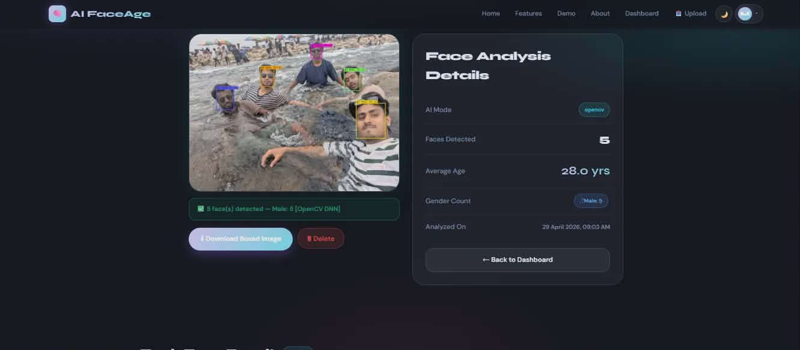

# 🧠 AI FaceAge — Deep Learning Age Detection


Face age detection using OpenCV DNN (Caffe models) with multi-face support.

---

## 🚀 Local Setup (Windows/Mac/Linux)

```bash
# 1. Clone and enter folder
git clone https://github.com/YOUR_USERNAME/age-ai-faceage.git
cd age-ai-faceage

# 2. Create virtual environment
python -m venv venv
venv\Scripts\activate        # Windows
source venv/bin/activate     # Mac/Linux

# 3. Install dependencies
pip install -r requirements.txt

# 4. Setup .env
cp .env.example .env
# Then edit .env with your values (Cloudinary, etc.)
# For local run, DATABASE_URL can be left empty → uses SQLite

# 5. Run
python app.py
# Open http://localhost:5000
```

---

## ☁️ Online Deployment (Render.com — Free)

1. Push to GitHub
2. Go to https://render.com → New Web Service → Connect GitHub repo
3. Set Environment Variables in Render dashboard:
   - `SECRET_KEY` = any random string
   - `AGE_AI_MODE` = opencv
   - `DEBUG` = False
   - `DATABASE_URL` = your Supabase postgres URL
   - `CLOUDINARY_CLOUD_NAME` = dtibugsis
   - `CLOUDINARY_API_KEY` = your key
   - `CLOUDINARY_API_SECRET` = your secret
4. Deploy!

---

## 🔑 Default Admin Login

- Email: `admin@gmail.com`
- Password: `admin123`
- ⚠️ Change this after first login!

---

## 🤖 AI Modes

| Mode | File | Speed | Accuracy |
|------|------|-------|----------|
| `opencv` | `models_opencv/*.caffemodel` | ⚡ Fast | Good |
| `pytorch` | `models/best_utkface_model.pth` | 🐢 Slower | Better |

Default is `opencv` — no GPU needed, works on Render/Railway free tier.

---

## 🏋️ Retrain the PyTorch Model (optional)

```bash
# Download UTKFace dataset first
# https://susanqq.github.io/UTKFace/
# Place images in dataset/UTKFace/

python train_utkface.py --data_dir dataset/UTKFace --epochs 10
# Saves to models/best_utkface_model.pth
```

---

## 📁 Project Structure

```
age-ai-faceage/
├── app.py                  # Flask routes
├── config.py               # Settings from .env
├── models.py               # SQLAlchemy DB models
├── predict_fixed.py        # OpenCV inference
├── train_utkface.py        # PyTorch training script
├── download_opencv_models.py
├── requirements.txt
├── Procfile                # Render/Heroku deploy
├── .env                    # Your secrets (NOT in GitHub)
├── .env.example            # Template (safe for GitHub)
├── .gitignore
├── models/
│   └── best_utkface_model.pth   ← your trained model
├── models_opencv/               ← pre-trained Caffe models
├── static/uploads/
└── templates/
```
## 🌐 Live Demo

[](https://aifaceage.netlify.app/)

---

## 📸 Screenshots

### 🏠 Home Page


### ⚙️ Admin Dashboard


### 📂 Admin Upload Check


### 👥 Admin User Check


### 🕘 Admin History


### 🤖 AI Detection Result 1


### 🤖 AI Detection Result 2


### 🤖 AI Detection Result 3


---

## 👥 Team — Green University of Bangladesh, CSE-404

| Name | Student ID |
|------|-----------|
| Md Raisul Islam | 231902037 |
| Md Mahabub Hasan Mahin | 231902056 |
| Chinmoy Debnath | 231902029 |
